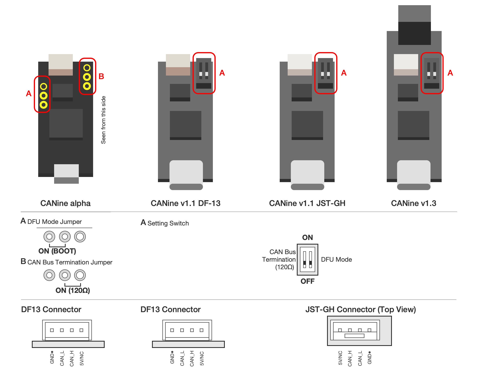

**********************
CANine adapter
**********************

Introduction
############

This is a USB Type-C <-> CAN Bus adapter. Itself it is an adaptation of the [CANable board](https://canable.io/). It features a 5.08mm screw terminal, a 4-pin JST-GH connector, and a 2.54mm header. In addition, it features a convenient DIP switch for setting CAN termination resistor and boot mode.

CANine includes the following hardware:

* STM32F042C6 MCU
* MCP2551 CAN Bus Transceiver
* JST-GH/5.08mm Screw Terminal/2.54mm Pin header CAN interfaces
* USB Type-C (v2) / micro (v1) interface

This design is Open Source, released under the original CANable license.

Hardware Configuration
######################

CAN Termination Resistor
------------------------

CANine includes a termination resistor to ease the setup of a CAN Bus network. If CANine is a terminal node in the network, you should enable the 120Ohm termination resistor via the onboard DIP switch. In small setups with a few nodes and short wires, it is enough to enable just a single termination resistor, either on the CANine or on a single Tinymovr.

Flashing Firmware
#################

CANine comes pre-flashed with `slcan <https://python-can.readthedocs.io/en/master/interfaces/slcan.html>`_.

Hardware Preparation
--------------------

Unplug the CANine adapter from USB. Flip the DFU switch to the ON position. Plug the adapter back into USB. The device will appear as a ST DFU Device, and allow firmware flashing. Once firmware flashing is complete, unplug the device and return the switch to the OFF position.

CANine Firmware
---------------

To try the CANine firmware, we offer `a simple Web-based firmware update service <https://tinymovr.github.io/CANine/>`_. Instructions are available on the page. Chrome and Edge are supported.

Python-Can Compatibility
************************

We offer a `python-can plugin available on PyPi <https://pypi.org/project/python-can-canine>`_, which allows use of CANine with python-can. The plugin is easily installable via pypi:

.. code-block:: console

    pip install python-can-canine

To use with Tinymovr Studio, add the command line parameter `--bus=canine` when launching.

In your scripts, use the CANine interface through a simple import:

.. code-block:: python

    import can
    from canine import CANineBus
    
    bus = can.Bus(interface="canine", bitrate=1000000)

Additional Windows Requirements
*******************************

You will need to install the libusb driver for your CANine. This is most easily done using `Zadig <https://zadig.akeo.ie>`_

Additional Macos Requirements
*****************************

You will need to install libusb. This can be easily done using `Homebrew <https://brew.sh>`_:

.. code-block:: console

    brew install libusb

In ARM-based Macs you may also need to link the homebrew library install path to the fallback path `/lib`. This can be done with the following command:

.. code-block:: console

    ln -s /opt/homebrew/lib ~/lib

slcan & CANdlelight Firmware
----------------------------

CANine is compatible with both slcan as well as candlelight firmware. If you would like to revert to these firmwares, the easiest solution is to use the `canable updater <https://canable.io/updater/>`_. Similarly to the CANine flasher, this updater works directly from within the browser. Chrome and Edge are supported.

